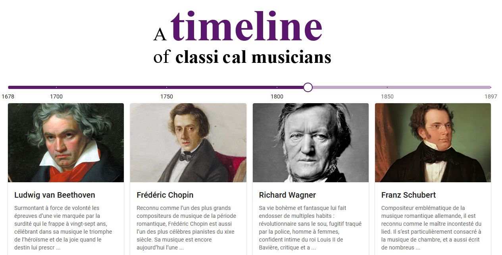

# Dans ce tutoriel, nous allons créer une belle application qui, à l'aide d'une timeline dynamique, nous permettra d'afficher les musiciens de musique classique qui ont vécu à une certaine époque.

*(proposé par BEN BK, ce tuto est sympa pour les débutants Réact)*

Au programme :

                REACT JS (useState, useEffect, Composants, render), 

                MATERIAL-UI (Grid, Slider, Card) 

                et SASS.

[Application visible ici](https://franckdun.github.io/timeline).

[Voir le tuto](https://youtu.be/Nvpzs5dLI1Y).

